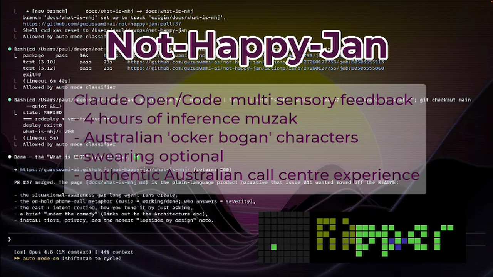
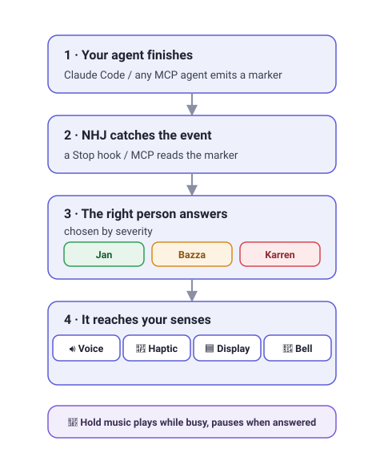

# Not-Happy-Jan

<p align="center">
  
</p>

**Multi-sensory feedback for AI coding agents.** When your coding agent finishes a task,
someone picks up the phone and tells you — cheerfully if it went well, *furiously* if it
didn't. Hold music while it works, a cast of cloned voices when it's done, and a buzz on
your mouse or a flash on a pixel display to match — all **100% on your own machine**.

> *"Not happy, Jan — the issue is…"*

📖 **[Read the docs](https://guruswami-ai.github.io/not-happy-jan/)** · 🎬 **[Watch the demo](https://guruswami-ai.github.io/not-happy-jan/watch-the-demo/)** (videos coming soon)

<!-- READY TO PUBLISH: drop docs/assets/video/demo-thumbnail.webp + replace VIDEO_ID, then uncomment.
<p align="center">
  <a href="https://www.youtube.com/watch?v=VIDEO_ID">
    
  </a>
</p>
-->

> ⚠️ **Public alpha** — an early, for-fun release that *will* have rough edges.
> [Open an issue](https://github.com/guruswami-ai/not-happy-jan/issues/new/choose) or
> [start a discussion](https://github.com/guruswami-ai/not-happy-jan/discussions). The
> **minimal install speaks instantly** with the bundled voice bank (no downloads); the
> full live experience wants an Apple-Silicon Mac and a one-off ~5 GB of local models.

## What you'll experience

- 🎷 **Hold music** plays while the agent is busy and pauses the instant it's done — a zero-attention "still working / finished" signal.
- 👩 **Jan** handles routine "all done". 🧑‍💼 **Bazza** escalates warnings. 📣 **Karren** takes over when it breaks — she is *NOT. HAPPY. JAN.*
- 🎚️ **Tune each character** — boganism, competence, chaos — just by asking Claude in plain language.
- 📟 **Fan out across devices** you already have — a haptic mouse, $60 pixel clocks, a LaMetric, a physical bell — or nothing but your speakers.

→ Meet the cast and the one-word modes: **[Characters & dials](docs/characters.md)** · **[Modes](docs/modes.md)**

<p align="center">
  
</p>

<p align="center">
  
  <br><em>…and on a $60 pixel display.</em>
</p>

## Install

```bash
curl -fsSL https://raw.githubusercontent.com/guruswami-ai/not-happy-jan/main/install.sh | bash
```

One command, non-interactive, **no `sudo`**. The default installs the full local
experience — cloned voices, the dynamic `ocker-bogan-nano` brain, and hold music — with
**on-demand model loading**, so there's no resident RAM cost at idle.

| Profile | Command | What you get |
|---|---|---|
| **Default** | `bash install.sh` | Full experience: Qwen3-TTS + `ocker-bogan-nano` LLM + hold music, on-demand; Claude hooks + MCP wired |
| **Full** | `bash install.sh --full` | …plus persistent warm TTS/LLM/MCP services (macOS) for sub-second responses |
| **Minimal** | `bash install.sh --minimal` | Hooks + MCP + the **bundled voice bank** — the cast speaks pre-recorded lines, no downloads (CI / low-RAM) |

The MCP server always binds to `127.0.0.1`; LAN access is an explicit opt-in
(`--full --listen 0.0.0.0`). **Uninstall** is one reversible, user-only command:

```bash
nhj uninstall          # stops services, removes runtime/config/models/hooks; --yes to skip the prompt
```

**Requirements:** macOS Apple Silicon (M1+), Python 3.10+, ~8 GB RAM (16 recommended),
~5 GB disk. The alpha is Apple-Silicon-only; `TTS_ENGINE=none` runs text-only.

→ **[Requirements & tiers](docs/minimum-specs.md)** · **[Install profiles](docs/install-profiles.md)** · **[Dynamic voices](docs/dynamic-voices.md)**

## Quick start

```bash
nhj test ok                       # fire a "done" across every configured channel
nhj voices                        # the cast + what each voice can speak with
nhj set jan.ockerism 11           # tune any dial live (or just ask Claude)
nhj mode rave                     # one-word vibe switch; nhj status to see current
```

→ Full walkthrough: **[Quick start](docs/quickstart.md)**

## Documentation

**[📖 guruswami-ai.github.io/not-happy-jan](https://guruswami-ai.github.io/not-happy-jan/)** — the full task-oriented docs site. By audience:

- **Trying it / choosing a profile** → [Requirements & tiers](docs/minimum-specs.md) · [Install profiles](docs/install-profiles.md) · [Quick start](docs/quickstart.md)
- **Living in it** → [Characters & dials](docs/characters.md) · [Modes](docs/modes.md) · [Audio & hold music](docs/AUDIO-STANDARD.md)
- **Wiring up devices & agents** → [Integration](docs/integration.md) · [AWTRIX display](docs/awtrix-display-setup.md) · [Haptic mouse](docs/haptic-mouse-setup.md) · [Devices](docs/devices/README.md)
- **Customizing** → [Dynamic voices](docs/dynamic-voices.md) · [Configuration](docs/configuration.md)
- **Building on it** → [Architecture](docs/ARCHITECTURE.md) · [Developer guide](docs/DEVELOPER-GUIDE.md) · [Contributing](CONTRIBUTING.md)

## Security & privacy

Inference runs **on-device** — the cloned-voice references never leave your machine.
Local services bind to `127.0.0.1` by default; LAN access is a deliberate opt-in. A
**secret guard** scans prompts for leaked credentials. Install/uninstall are user-context
only (no `sudo`) and fully reversible. Report vulnerabilities via [SECURITY.md](SECURITY.md).

## Credits & license

Evolved from an earlier personal agent-feedback project by Paul Nevin. TTS powered by
[Qwen3-TTS](https://huggingface.co/mlx-community/Qwen3-TTS-12Hz-0.6B-Base-8bit) via
[mlx-audio](https://github.com/ml-explore/mlx-audio).

Code is [MIT](LICENSE). Downloadable **media and voice assets are licensed separately**
with mixed provenance — mostly AI-generated (CC0) or procedurally synthesised, hold music
under a licensed Suno plan. See **[Media provenance](docs/media-provenance.md)**; do not
assume the code license grants rights to media, and use only voice references you own or
have documented consent to use.
