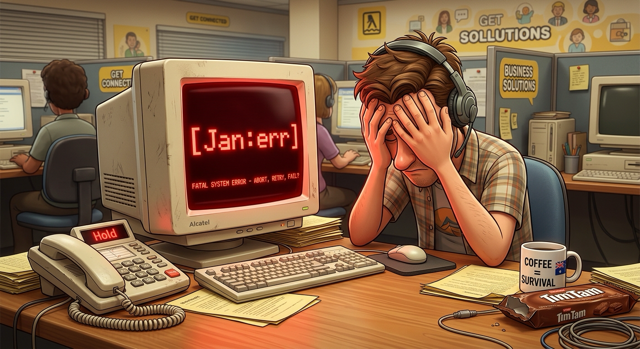

# Not-Happy-Jan

<p align="center">
  
</p>

Multi-sensory feedback for AI coding agents. When your agent finishes a task, Jan tells you. When something goes wrong, Karren lets you know — loudly.

> *"Not happy Jan, the issue is…"*

> ⚠️ **Public alpha** — an early, for-fun release that *will* have rough edges. Found a bug?
> [Open an issue](https://github.com/guruswami-ai/not-happy-jan/issues/new/choose). Got an idea,
> a question, or want to show off your bogans? [Start a discussion](https://github.com/guruswami-ai/not-happy-jan/discussions).
> The **minimal install speaks instantly** with the bundled voice bank (no downloads); the full
> live experience wants an Apple-Silicon Mac and ~5 GB of local models.

<!-- Demo: once recorded, drop it at docs/assets/demo.gif and uncomment:
<p align="center"></p>
-->

## ☎️ The Call-Centre Experience

Ever feel like you're on hold, waiting for your agent to finish processing?

<p align="center">
  
</p>

**Not-Happy-Jan** makes Claude Code feel like a genuine call to a government department — multiple tiers of staff, hold music, and constant feedback delivered with a *customisable level of competence and boganism* — all while you wait for your token quota to fill back up.

- 🎷 **Hold music** plays while the agent's busy, pauses the instant someone picks up
- 👩 **Jan** — reception. Handles the routine stuff. Cheerful, occasionally scatty.
- 🧑‍💼 **Bazza** — middle management. Escalates when things get warm. Apathetic to anxious, your call.
- 📣 **Karren** — the manager. Takes over when it all goes wrong. She is *NOT. HAPPY. JAN.*
- 🎚️ Dial in each character's **competence**, **boganism** and **chaos** to taste — by just asking.

## What it does

By default NHJ generates its voices with a **local TTS model**, running right on your own machine — building on earlier agent-feedback work, but going much further. NHJ is **extensible** to a whole range of feedback tools: from the haptic Logitech MX Master mouse to $60 Ulanzi pixel displays, LaMetric Time, the Divoom Times Gate / Frame — or anything you can POST to, like a Vestaboard. When Karren's not happy, Jan *and you* are going to know about it.

When Claude Code (or any MCP-compatible agent) completes a task, NHJ fires across every output channel you have configured:

| Channel | Device | What happens |
|---|---|---|
| Haptic | Logitech MX Master 4 mouse | Distinct firmware waveform per intent (`completed`, `angry_alert`, `firework`…), escalating insistence — opt-in, talks straight to the mouse (no Logitech software) — [setup](docs/haptic-mouse-setup.md) |
| Visual | LaMetric Time | Icon + text + built-in sound |
| Visual | ULANZI TC001 (AWTRIX 3) | Random icon + effect + in-character text, to one or many over MQTT |
| Visual | Divoom Times Gate / Frame | Coloured text notification |
| Audio | TTS (local or cloud) | Character speaks a phrase |
| Physical | ESP32 push bell | Electromechanical bell rings |

## The cast & modes

Three tiers answer the phone depending on severity — **Jan** (reception), **Bazza** (middle management), **Karren** (the manager). Each has its own zero-shot-cloned voice and **live dials** (boganism, competence, chaos) you tune just by asking Claude. One-word **modes** (`rave`, `call-centre`, `quiet`, `special-forces`, `went-full-bogan`…) reconfigure the whole vibe — music, voice, displays, haptics — at once.

→ **[Characters & dials](docs/characters.md)**  ·  **[Modes](docs/modes.md)**

## Install

```bash
curl -fsSL https://raw.githubusercontent.com/guruswami-ai/not-happy-jan/main/install.sh | bash
```

Or install from a checkout:

```bash
git clone https://github.com/guruswami-ai/not-happy-jan
cd not-happy-jan
bash install.sh
```

One command, non-interactive. It downloads the source and bootstraps `uv` plus a
managed Python runtime when required. The default profile installs the full
experience — venv, Qwen3-TTS voice model, the `ocker-bogan-nano` LLM, bundled
media, Claude Code hooks, and MCP server (stdio, localhost-only) — using
**on-demand model loading** (no always-on daemon, so no resident RAM cost at idle).

> **👉 Just run `bash install.sh` — and go for the full experience.** The default *is*
> the full experience, and it's what Not-Happy-Jan is *for*: Jan, Bazza and Karren in
> their own **live, cloned voices**, the **dynamic `ocker-bogan-nano` brain** writing a
> fresh in-character line every time, and **4+ hours of hold music** ducking under it
> all — 100% local, loaded on demand (nothing resident at idle). It's a one-off ~5 GB
> download on an Apple Silicon Mac, then it just works.
>
> `--minimal` (pre-recorded bank, zero downloads) is there for CI and RAM-tight machines —
> the cast still speaks, but you miss the live voices, the dynamic lines, and the music.
> Don't reach for it unless you have to.

| Profile | Command | What you get |
|---|---|---|
| **Default** | `bash install.sh` | Full experience — Qwen3-TTS + the `ocker-bogan-nano` LLM + hold music, on-demand loading; hooks + MCP wired |
| **Full** | `bash install.sh --full` | The default, plus persistent TTS / LLM / MCP LaunchAgents and warm model servers (macOS) for sub-second responses |
| **Minimal** | `bash install.sh --minimal` | Hooks + MCP + the **bundled voice bank** — the cast speaks pre-recorded in-character lines; no model downloads (CI / low-RAM) |

The MCP server always binds to `127.0.0.1`. LAN access requires an explicit opt-in: `bash install.sh --full --listen 0.0.0.0`.

**Uninstall** — one command **stops the TTS/LLM/MCP services**, then removes everything (runtime, config, downloaded models/media, the `nhj` launcher, and NHJ's Claude hooks/MCP/markers/skill); your Claude install is left intact. Like the install, it runs **entirely in your user account — no `sudo`** (user-domain LaunchAgents, files under `$HOME`):

```bash
nhj uninstall          # add --yes to skip the confirmation
```

**The dynamic brain — included in the default install.** `bash install.sh` (and `--full`)
download **ocker-bogan-nano**, NHJ's own fine-tuned LLM, so every line is freshly generated
*in character* instead of replayed from the bundled bank. It needs `llama.cpp`
(`brew install llama.cpp`); if that's missing the installer notes it as a follow-up and the
bundled bank still works. To (re)install or point at your own model:

```bash
nhj install-model    # ~940 MB Q4_K_M GGUF, runs as a local llama.cpp server — 100% local, sub-second
```

Why it's worth it, the BYO-model path, and the swearing/bleep behaviour are all in **[Dynamic voices](docs/dynamic-voices.md)**.

**Requirements:** macOS Apple Silicon (M1+), Python 3.10+, ~8 GB RAM (16 recommended), ~5 GB disk. The initial alpha supports Apple Silicon macOS only. `TTS_ENGINE=none` runs text-only; low-spec machines can run from pre-recorded samples. The three ways to run it (silent · pre-recorded · full live experience) → **[Minimum specs](docs/minimum-specs.md)**; install profiles → **[Install profiles](docs/install-profiles.md)**; settings → **[Configuration & requirements](docs/configuration.md)**.

## Quick start

```bash
# Test all configured adapters
nhj test ok
nhj test err --message "something broke"

# List available voices
nhj voices

# List configured devices
nhj devices

# Pre-render audio bank for faster playback
nhj build-bank --voice jan

# Live settings — no restart needed (or just ask Claude in plain language)
nhj muzak on                # inference muzak while the agent works
nhj set jan.ockerism 11     # tune any character dial (jan.competence, bazza.stress, …)
nhj mute                    # silence everything;  nhj unmute to restore
nhj status                  # show current settings
```

## Documentation

| Guide | What's inside |
|---|---|
| **[Architecture](docs/ARCHITECTURE.md)** | The serious technical design — custom LLM, fine-tuned TTS, hooks, queue + sequencing, multi-sensory dispatch, and the latency/resource tradeoffs behind it all |
| **[Characters & dials](docs/characters.md)** | The cast, the dials, tuning live, adding your own voice |
| **[Modes](docs/modes.md)** | One-word vibe switches (rave, call-centre, quiet, special-forces…) |
| **[Dynamic voices](docs/dynamic-voices.md)** | The `ocker-bogan-nano` brain — why/what/install, BYO model, swearing & the bleep |
| **[Minimum specs](docs/minimum-specs.md)** | The three tiers: silent · pre-recorded samples · the full live bogan call-centre |
| **[Configuration & requirements](docs/configuration.md)** | `.env`, devices, inference muzak, TTS backends, specs |
| **[Integration](docs/integration.md)** | Claude Code hooks, legacy-hook supersession, other agents, the secret guard, adding a device |
| **[Audio Standard](docs/AUDIO-STANDARD.md)** | The single-stream mixer, fidelity tiers, gapless hold, every audio control |
| **[AWTRIX display setup](docs/awtrix-display-setup.md)** | A Ulanzi pixel clock running in ~10 minutes |
| **[Haptic mouse setup](docs/haptic-mouse-setup.md)** | MX Master 4 firmware haptics |
| **[Devices overview](docs/devices/README.md)** | Supported hardware + where to start |

## Your new friends

NHJ is fully customisable: **72 HR-approved hold-music tracks** (over **4 hours** of on-hold listening pleasure), **replaceable personalities**, and **zero-shot voice cloning** — drop in any voice you like. But we reckon that once you've got to know Jan, tuned her competence and bogan settings to your liking, and met anxious Bazza and cranky Karren, you won't want to code with Claude without your new friends.

## Credits

Evolved from an earlier personal agent-feedback project by Paul Nevin.
TTS powered by [Qwen3-TTS](https://huggingface.co/mlx-community/Qwen3-TTS-12Hz-0.6B-Base-8bit) via [mlx-audio](https://github.com/ml-explore/mlx-audio).

## License

Code is available under the [MIT License](LICENSE). Downloadable media and voice
assets are licensed **separately** from the code and have mixed provenance —
mostly AI-generated (released CC0) or procedurally synthesised, with hold music
generated under a licensed Suno plan. See **[Media provenance](docs/media-provenance.md)**
for per-asset terms. Do not assume the code license grants rights to media, and
use only voice references you own or have documented consent to use.
