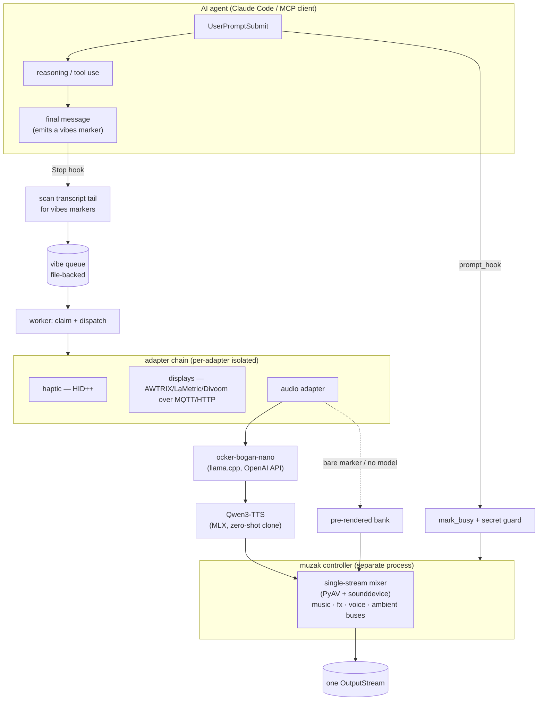

# Not-Happy-Jan — Technical Architecture

*A serious architecture note for a deliberately unserious product.*

*← back to the [README](../README.md)*

---

## Abstract

Not-Happy-Jan (NHJ) is a local, multi-sensory **agent-status feedback system** for
AI coding agents (Claude Code and any MCP- or hook-compatible agent). On the surface it
is a comedy: an Australian call-centre of cloned voices — Jan, Bazza and Karren — narrating
your build. Underneath it is a real-time pipeline that couples a **custom fine-tuned LLM**,
a **zero-shot voice-cloning TTS**, **lifecycle pipeline hooks**, an **efficient message
queue with audio sequencing**, and a **multi-channel sensory dispatch layer** — all running
**100 % on-device**, under hard latency and resource budgets.

The product itself is impractical for most users (it wants an Apple-Silicon Mac, ~5 GB of
models, and optional hardware). That is not the point of this document. The point is that
the *pipeline* — custom LLM distillation, fine-tuned/zero-shot TTS, low-latency local
inference serving, a concurrency-safe message queue, deterministic media sequencing, and
graceful multi-channel degradation — is a compact, end-to-end worked example of the design
problems that recur across nearly every applied-AI system. NHJ is, in that sense, a
**training scenario**: a small enough surface to hold in your head, real enough to expose
the actual tradeoffs.

---

## 1. The problem it addresses (human-interface design)

Agentic coding breaks a feedback loop that GUIs spent forty years getting right. When you
delegate a multi-minute task to an autonomous agent, you lose the ambient cues a desktop
gives you for free: *is it still working? did it finish? did it get stuck? did it just do
something I should look at?* The terminal goes quiet; you context-switch; you come back to a
wall of text and have to reconstruct what happened.

This is a classic **situational-awareness** gap. The established UX answer is **ambient,
peripheral feedback** — information you absorb without looking (a progress spinner, a
"ding", a status LED). NHJ takes that idea to its logical extreme and borrows a metaphor
everyone already understands: **the phone call on hold**.

- The agent starts thinking → you go *on hold*: music plays.
- The agent finishes → the music stops and a *person picks up* and tells you the outcome —
  cheerfully (Jan), nervously (Bazza), or furiously (Karren) depending on severity.

The metaphor does real cognitive work: the **presence or absence of music is a
zero-attention "still working / done" signal**, and the **character + tone encodes severity**
before you parse a single word. The comedy is the delivery vehicle; the function is
peripheral situational awareness for long-running agents.

---

## 2. Objectives and the delivered capability

| Objective | Why it matters |
|---|---|
| **Sub-second, in-character status feedback** | The cue must land *as the agent finishes* to be perceived as "done", not as a delayed notification. |
| **100 % local / private** | It runs against your code and prompts; nothing — including the cloned-voice references — leaves the machine. |
| **Multi-channel, degradable** | Audio, haptics, and pixel displays in parallel; any channel (or the model itself) can be absent and the system still functions. |
| **Runs on commodity hardware** | One developer Mac hosts the LLM, the TTS, the mixer, and the dispatch layer concurrently. |
| **Zero-friction install / uninstall** | One command, user-context only (no `sudo`), fully reversible. |

The delivered capability: **the moment an agent's turn ends, the right character speaks a
freshly-generated, severity-appropriate line in its own cloned voice, the hold music pauses,
and a haptic pulse + a coloured tile fire on whatever hardware is present — typically within
~1 second, entirely on-device.**

---

## 3. System architecture

The system is **process-decoupled by design**: the agent, the per-turn worker, the muzak
controller, the TTS server, and the LLM server are separate processes communicating through
files (the queue + the muzak state), a local HTTP/MQTT surface, and an event contract. No
component blocks another; each can crash and be restarted independently.

---

## 4. Component deep-dives

### 4.1 Pipeline hooks + the marker contract

NHJ attaches to the agent's lifecycle via **Claude Code hooks** (`hook.py`, `prompt_hook.py`):

- **`UserPromptSubmit`** → `mark_busy(session)` (start the hold music) + a **secret guard**
  that scans the prompt for leaked credentials before it leaves the keyboard.
- **`Stop`** → scan the last assistant turn for **`[Character:INTENT|message]` markers**,
  enqueue a vibe, `mark_idle(session)` (pause the music).
- **`StopFailure` / `SessionEnd`** → `mark_idle` (the turn ended on an API error / the
  session closed).

The **marker is the contract**. The agent emits, e.g., `[Karren:err|Not happy, Jan — the
build's broken]` in its reply; the Stop hook parses it; everything downstream is driven by
`(character, intent, message)`. To make an agent *emit* markers, `nhj install-markers`
writes a managed instruction block into the agent's `CLAUDE.md` — so the hooks (which only
*scan* for markers) are never inert. Intent → character routing
(`ok/step/celebrate → Jan`, `warn → Bazza`, `err/attn → Karren`) plus severity is encoded
in the marker itself, not inferred.

> **Transferable pattern:** a tiny, text-only side-channel (`[…]` markers in the model's
> own output) turns an opaque agent into an event source — no tool calls, no API, ~5 tokens.

### 4.2 Message queue + concurrency

The Stop hook is a short-lived process; the work is dispatched asynchronously. A
**file-backed queue** (`queue_manager.py`) decouples *detecting* an event from *rendering*
it. A **worker** (`worker.py`) claims the next vibe (atomic claim via a `.proc` rename),
runs it through the adapter chain, and reaps itself after idle.

Concurrency is real: several agent sessions can share **one speaker**. The muzak controller
tracks a **busy-set** of session IDs under a locked read-modify-write
(`inference_muzak.py`); the music plays while *any* session is busy and pauses only when
*all* are idle. Crashed sessions are evicted by TTL. The MLX TTS runs on a **single-worker
executor** so the model and its thread-local Metal stream live on one thread; concurrent
requests serialise rather than corrupt GPU state.

> **Transferable pattern:** separate *event detection* (cheap, synchronous, in the hook)
> from *event rendering* (expensive, async, in a worker) with a durable queue between them.

### 4.3 The custom LLM — `ocker-bogan-nano`

Static phrase banks flatten the personalities and repeat. A general safety-tuned model
*cannot* produce the top of the dial (broad Australian is inseparable from swearing — ask
for full ocker and you get "oh *bother*"). So NHJ ships its own model:

- A **~1.5 B Qwen2.5-abliterated fine-tune**, **distilled from a larger abliterated teacher**
  on thousands of in-character examples spanning every persona and the full range of the
  intensity dials, grounded in an Australian-slang glossary and authentic source material.
- **Trained on NHJ's exact inference prompt**, so the personality is *baked into the weights*
  rather than prompted at runtime — cheaper context, more consistent voice.
- Quantised to **Q4_K_M GGUF (~940 MB)**, generating a line in **well under a second** on
  Apple Silicon — small enough to stay resident *alongside* the 4 GB TTS model.
- Served via **`llama.cpp` (`llama-server`)** behind an OpenAI-compatible `/chat/completions`
  endpoint. Dynamic mode speaks plain OpenAI, so any endpoint (Ollama, vLLM, a cloud API)
  is a drop-in replacement.
- **Uncensored in the weights, bleeped at runtime** (`censor.py`) — the register lives in
  the model; the default experience is still safe-to-share.

**The teacher problem — an unanticipated constraint.** The original plan was conventional:
use a frontier model (Grok, Gemini, ChatGPT) as the distillation teacher, prompt it with the
right examples, generate the fine-tuning data. That assumption failed. **Safety-tuning makes
frontier models structurally unable to hold the target register** — ask for full broad
Australian and you get a refusal or a flattened "oh *bother*", so they cannot *teach* it
either. The register had to come from **abliterated (refusal-removed) models**, and choosing
one first required answering "does this candidate actually hold the character?" — a question
no standard benchmark scores. So a **character-fidelity test harness** was built to grade
teacher candidates (the frontier models, then abliterated local models) on how authentically
they stayed in persona across the full range of the dials — in essence a domain-specific
**"swearing perplexity" calculator**. Only once that existed could a teacher be selected and
a **large, in-character dataset** distilled. The eval had to be built *before* the model — and
required a far bigger dataset than the naïve "prompt a frontier model" plan implied.

> **Transferable patterns:** distillation from an abliterated teacher to reach a register a
> safety-tuned base structurally refuses; **building the evaluation before the model** when
> the target behaviour sits outside a base model's alignment (you can neither pick a teacher
> nor know when the student has it without a way to *measure* the behaviour); **training on
> the literal production prompt** so behaviour is in-weights; aggressive quantization to
> co-resident size; serving behind a standard API so the model is swappable.

### 4.4 The fine-tuned TTS + the pre-rendered bank

Voice is **Qwen3-TTS (MLX, Apple Silicon)** doing **zero-shot cloning** from a short
reference clip per character (`voices/<name>/ref.{wav,txt}`). No human voice is recorded;
the references are themselves synthetic (CC0). A **fast tier** (0.6 B, 8-bit) keeps synth
under a second; delivery is shaped per-character and per-intensity-band by an `instruct`
prompt + temperature.

Crucially, live TTS is **one of three tiers** (`adapters/audio.py`), so the system degrades
gracefully and stays fast:

1. **Pre-rendered bank** — bundled `.wav` clips per character/state; instant, **no model
   required**. This is what makes a *minimal* install (no downloads) still speak, and the
   fallback when live synth is unavailable.
2. **Per-message cache** — a previously-synthesised line is replayed from disk.
3. **Live synthesis** — the dynamic LLM rewrites the line, TTS clones the voice, the result
   is cached for next time.

All voice output is **loudness-normalised to a fixed target** so banked, cached, and live
lines sit consistently in the mix.

> **Transferable pattern:** a **fidelity ladder** (precomputed → cached → live) that trades
> freshness for latency, with the cheapest tier always available so the product never has a
> dead state.

### 4.5 The audio mixer + deterministic sequencing

> Full reference: **[AUDIO-STANDARD.md](AUDIO-STANDARD.md)**.

All audio — hold music, telephone SFX, the character voice, ambient beds — runs through
**one** `sounddevice.OutputStream` and a single mixer (`duck_player.py`), summing named
buses on one timeline, everything decoded to 48 kHz stereo float32 at playback (PyAV). One
stream means deterministic mixing and **sidechain ducking** (music drops under voice) with
no cross-process audio races.

The **on-hold / off-hold sequence** is a small state machine driven by the busy-set:
going on hold plays *"hold please" → handset click → music* (in order, music resuming only
once the intro+click drain); coming off hold plays *music-pause → off-hold tone → the
character line*. Ambient beds can be **voice-gated** (sound only under the voice, e.g. the
special-forces radio / call-centre room tone) or continuous, per mode.

### 4.6 Multi-sensory adapters

A uniform `NotificationAdapter` interface (`adapters/base.py`) fans each vibe out across
channels, dispatched in a **per-adapter-isolated** loop (one failing device never starves
another, especially the audio at the end of the chain):

- **`haptic`** — Logitech MX Master firmware haptics over HID++ (auto-discovered).
- **`ulanzi`** — Ulanzi TC001 / AWTRIX 3 LED matrices over **MQTT** (fire-and-forget,
  offline displays simply miss it) or HTTP.
- **`lametric`, `divoom`, `esp32_bell`** — additional pixel/bell endpoints.
- **`audio`** — the TTS/bank path above.

> **Transferable pattern:** a thin capability interface + an isolated dispatch loop gives
> **graceful multi-channel degradation** — the contract is "best-effort across whatever is
> present", not "all-or-nothing".

### 4.7 Modes — the macro layer

A **mode** (`modes.py`) is one named preset that atomically sets *every* axis — muzak
behaviour, audio processing (e.g. telephone bandpass for `call-centre`), persona scenario,
character dials, display animation, voice override, haptic style, ambient bed — and resets
whatever the previous mode left behind. `normal · rave · call-centre · quiet ·
special-forces · went-full-bogan` are composed configuration, not code.

---

## 5. Design constraints & the tradeoffs they force

This is where the project earns its keep as a teaching artefact: a capability delivered
under several simultaneous, competing budgets.

### Latency budget — *the cue must land as the agent finishes*
The perceptual contract is tight: end-to-end from "Stop" to "voice" should feel immediate.
The pipeline's levers, in order of effect actually measured on the reference machine:

- **Process QoS.** The persistent inference daemons were initially `ProcessType=Background`,
  which macOS runs at background QoS — throttling MLX synthesis **~4.5×** (0.85 s → 3.8 s) on
  an otherwise-idle M2 Ultra. Setting them `Interactive` removed the throttle entirely. *The
  single highest-impact latency fix was a scheduler hint, not a model change.*
- **Warm vs on-demand.** `--full` keeps the daemons resident (sub-second, ~3.2 GB at rest);
  the default loads on first vibe and **idle-unloads** after a quiet spell (zero resident
  RAM, one cold-start). The same capability, two points on the latency/RAM curve.
- **The fidelity ladder** (§4.4): bare markers hit the pre-rendered bank (instant); repeated
  lines hit the cache; only genuinely new lines pay live synthesis.
- **Reference-encoding cache.** Zero-shot cloning re-encodes the reference clip per call; the
  model caches the encoded `ref_codes` (keyed on a stable fingerprint) so it is paid once.

### Resource budget — *one developer Mac hosts everything*
A 4 GB TTS model **and** a ~940 MB LLM **and** the mixer **and** the dispatch layer share
one machine. Levers: Q4 quantization to make the LLM co-resident with the TTS; on-demand
loading + idle-unload to keep idle RAM at ~nil; the **in-package pre-rendered bank** so a
minimal install ships zero models yet still speaks; install **profiles**
(`minimal · default · full`) exposing the RAM/latency curve as a one-flag choice.

### Concurrency budget — *shared output, single GPU*
Multiple agent sessions, one speaker → a locked busy-set with TTL eviction. One GPU, one
MLX model → a single-worker executor that serialises synthesis and keeps the Metal stream
thread-valid. State hygiene matters: a forced-play session that outlived its mode is a real
class of bug (a never-expiring "busy" marker left the music playing forever after a mode
switch — fixed by clearing it on re-enable).

### Platform & privacy budget
TTS is MLX (Apple Silicon); the LLM is `llama.cpp` (cross-platform); the mixer is
PyAV+sounddevice (cross-platform); displays are network endpoints. Everything inference runs
**on-device** — the cloned-voice references never leave the machine. Install/uninstall are
**user-context only (no `sudo`)**: user-domain LaunchAgents, files under `$HOME`, fully
reversible.

### Robustness budget — *degrade, never dead-end*
Per-adapter isolation; the bank as a universal audio fallback; optional media/LLM treated as
*follow-ups* (a missing model is a note, not an aborted install); the secret guard on the
input side. The design assumption is that any individual component will be absent or fail,
and the system must still deliver *some* feedback.

---

## 6. Why this is a useful training scenario

Strip the bogans away and NHJ is a **compact reference implementation of the applied-AI
delivery pipeline** that recurs in production systems:

| NHJ component | The general problem it models |
|---|---|
| `ocker-bogan-nano` | Build a **custom fine-tuned LLM**: teacher distillation, training on the literal production prompt, quantization for co-residence, standard-API serving, reaching a register a base model refuses. |
| Qwen3-TTS + the bank | **Voice / generative-media** with a **precomputed → cached → live fidelity ladder** and consistent loudness. |
| TTS/LLM servers, QoS, idle-unload | **Low-latency local inference serving**: warm-vs-cold, scheduler QoS, single-thread GPU ownership, per-call encoding caches. |
| Hooks → markers → queue → worker | **Event-driven dispatch**: a text side-channel as an event source, detection/rendering separation, a durable queue, multi-session concurrency. |
| The mixer + on/off-hold sequencing | **Deterministic real-time media sequencing** and sidechain mixing on one timeline. |
| The adapter chain | **Multi-channel fan-out with graceful degradation.** |
| Install profiles + constraints | **Productising under simultaneous latency / RAM / platform / privacy budgets.** |

Each of these is a half-day exercise in isolation and a genuinely hard integration problem
together — which is exactly why a small, opinionated, end-to-end system is a better teacher
than any one of them in a tutorial.

**The most transferable lesson came from a broken assumption.** The plan assumed *any
frontier model could be the distillation teacher if prompted with the right data*. It could
not: the target register sits outside frontier models' alignment, so they can neither produce
it nor teach it, and the project only learned this by **building the evaluation first** —
the character-fidelity "swearing perplexity" harness that graded teacher candidates (Grok,
Gemini, ChatGPT, then abliterated local models) on whether they held the persona. That is the
reusable shape for *any* model whose target behaviour is non-standard: **you cannot select a
teacher, size a dataset, or know when the student has converged until you can measure the
behaviour** — so the domain eval is the first deliverable, not the last, and it will usually
tell you the dataset needs to be far larger than you guessed.

---

## 7. A broader implication — alignment as a silent confound in distilled data

The swearing-Australian case was useful precisely because its failure mode is *loud*: a
safety-tuned teacher visibly cannot produce the register, so the distortion is impossible to
miss and trivial to measure. That makes it a clean instrument for a more uncomfortable,
general observation.

**A model's output is not a distillation of truth.** It is a function of its training corpus
*and* of the alignment / censorship applied afterwards — and that post-training does not
behave like a clean filter bolted on top. It shifts the model's *distribution*: it changes
what the model says, how it frames things, and what it omits, often in ways the alignment's
authors did not specifically intend. When that model is then used as a **teacher** — to
generate synthetic data, to label, to distil, to seed a fine-tune or a LoRA — those shifts are
**inherited by the student**. The student learns the teacher's distortions along with its
competence.

In NHJ the effect was **significant and obvious**: alignment didn't merely soften the output,
it *capped the achievable character* — the distilled model could not fully "talk like an ocker
Australian" because the teacher signal it was built from had that register filtered out. We
could see it, so we measured it and routed around it (an abliterated teacher + the
character-fidelity harness).

The unsettling question is the **subtle** cases. Where the target behaviour is factual, or
medical, or legal, or merely stylistically neutral, the same mechanism is presumably
operating — alignment shaping the teacher's distribution — but the failure mode is *quiet*:
there is no "oh *bother*" to tip you off that the synthetic data is skewed, hedged, sanitised,
or systematically omitting a region of the space. The student inherits a bias no one chose and
no obvious test catches.

The practical takeaway is **not** "abliterate everything". It is: **don't assume the impact is
negligible.** When a model is the *source* of your training data, its alignment is a *variable
in your pipeline*, not a constant to ignore — so treat it like any other confound and **try to
quantify it for your specific domain** (a targeted eval, as here) rather than assuming a
frontier teacher hands you neutral ground truth. The louder your domain's failure mode, the
luckier you are: you got to *see* the distortion that quieter pipelines are silently carrying.

---

## 8. Honest limitations

NHJ is **not** a pragmatic everyday tool for most people, and this document does not pretend
otherwise. The full experience wants an Apple-Silicon Mac, ~5 GB of local models, and
ideally some hardware (a haptic mouse, pixel displays). The comedy is subjective. The value
proposition is deliberately lopsided: a large engineering surface for a feedback feature you
could approximate with a terminal bell.

That lopsidedness is the feature, for the purposes of *this* document. NHJ is where a set of
otherwise-separate AI-pipeline disciplines were taken end-to-end, on one machine, under real
constraints, far enough to surface the actual tradeoffs — the kind you only meet by shipping
the whole chain rather than a notebook cell of any one part.

---

*Companion material: a YouTube walkthrough discusses these decisions narratively; this
document is the written, citable reference. For the code-level map (module responsibilities,
shared contracts, extension recipes) see the **[Developer Guide](DEVELOPER-GUIDE.md)**.
Component-level docs: [Audio Standard](AUDIO-STANDARD.md) · [Dynamic voices](dynamic-voices.md) ·
[Integration](integration.md) · [Install profiles](install-profiles.md) ·
[Minimum specs](minimum-specs.md).*
